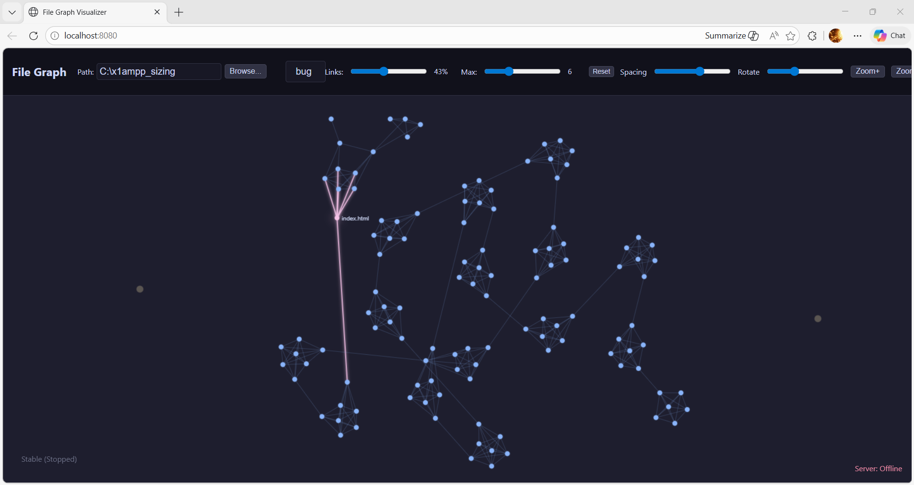
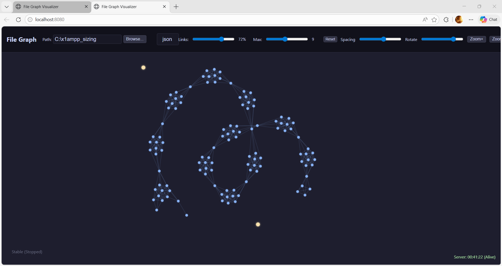

# File Graph Visualizer (Star Colony)

A standalone Go web application to scan directories, extract file metadata, calculate similarity embeddings (26D Vector Space), and visualize relationships as an interactive 2D interactive graph.

## Build & Compilation Requirements

### Go Language Version
- **Go 1.21.1** (as specified in `go.mod`)
- Minimum compatibility: Go 1.19+ should work

### Operating System & Architecture
- **Primary Development OS**: Windows 10/11 (amd64)
- **Compilation Target**: Windows executable (`file_graph_server.exe`)
- **Cross-compilation**: Possible for Linux/macOS via `GOOS`/`GOARCH` env variables

### Building from Source
```bash
# Clone repository
git clone https://github.com/your-username/file_graph.git
cd file_graph

# Build for Windows (default)
go build -o file_graph_server.exe main.go

# Build for Linux
GOOS=linux GOARCH=amd64 go build -o file_graph_server main.go

# Build for macOS (ARM64 M1/M2)
GOOS=darwin GOARCH=arm64 go build -o file_graph_server main.go
```

## Project Roles & Direction
- **Lead Programmer & Director**: The User
- **AI Team Assistance** (Last Updated: 2026-03-10):
  - Gemini CLI (Powered by multiple models)
  - OpenCode (Advanced AI coding assistant)
  - Minimax-M2.5-Free (Fast code generation model via OpenCode)
  - DeepSeek-V3.2-Exp (Large language model for complex reasoning)

## Special Technical Advisory
**Frontend Performance Analysis** by **Gemini Web App**:
- Identified browser rendering limits at 1K-5K nodes
- Recommended WebGL migration for 12K+ node visualization
- Proposed Worker thread architecture for 40D vector processing
- Advised Float32Array optimization for memory efficiency

See [_theory/frontend_optimization_advisory.md](_theory/frontend_optimization_advisory.md) for detailed technical guidance.

## Core Concept
This program treats the filesystem as a high-dimensional universe where files are stars. Related files cluster together into "Star Colonies" based on their metadata and content signatures.

### Documentation
- **Theoretical Concept**: [English](_theory/concept.md#english-version) / [ภาษาไทย](_theory/concept.md#ภาษาไทย)
- **User Manual & Features**: [English](_doc/manual.md#english-version) / [ภาษาไทย](_doc/manual.md#ภาษาไทย)

## Features
- **26D Embedding Vector**: Extracts size, name, time, and content hash (SHA-256).
- **Advanced Extensions (Future Proofing)**: The framework supports up to 42D with path Fibonacci hash and text analysis.
- **Smart Link Detection**: Folder proximity, filename prefix/suffix, reduced number proximity.
- **Memory Optimized**: Configurable batch size for low-RAM systems (-low_ram, -ram8g, -ram16g).

## Screenshots





## Getting Started
1. Clone the repository.
2. Run `RUN.bat` (automatically uses `-ram8g` for 8GB RAM systems).
3. Open `http://localhost:8080` in your browser.

**Manual startup (custom folder):**
```bash
file_graph_server.exe -startpath="C:\myproject" -ram8g
```

## Command Line Options

```bash
file_graph_server.exe [options]
```

### Options
- `-startpath=<folder>` - Initial folder to scan on startup
- `-port=<number>` - Port to listen on (default: 8080)
- `-threshold=<0.0-1.0>` - Similarity threshold (default: 0.75, lower = more links)
- `-batch=<number>` - Batch size for scanning (default: 1000, lower = less memory)
- `-low_ram` - Low memory mode (~300 batch, 0.6 threshold)
- `-ram8g` - 8GB RAM profile (~500 batch, 0.65 threshold) - **Recommended for your system**
- `-ram16g` - 16GB RAM profile (~800 batch, 0.7 threshold)

### Link Detection Bonuses

| Condition | Bonus |
|-----------|-------|
| Same folder | +0.40 |
| Same number (file1.txt = file1.txt) | +0.15 |
| Adjacent numbers (file1.txt ↔ file2.txt) | +0.08 |
| Close numbers (diff ≤3) | +0.03 |
| Same extension (.go, .txt) | +0.15 |
| Same name suffix (3+ chars) | +0.03 per char |
| Same name prefix (3+ chars) | +0.05 per char |
| Same last 4 chars | +0.10 |
| Same size last 3 digits | +0.05 |

### UI Controls

- **Spacing slider**: Adjust repulsion force between nodes
- **Rotate slider**: Add rotation to spread nodes radially
- **Links slider (1-100%)**: Filter to show only top X% strongest links
- **Zoom+ / Zoom-**: Zoom in/out (2x per click, max 50x)
- **1:1**: Reset zoom to 100%
- **Shake**: Add random energy to break stable clusters
- **Reset**: Reset links filter to 100%

### Examples

```bash
# Show help
file_graph_server.exe

# Scan specific folder (use double quotes)
file_graph_server.exe -startpath="C:\My Projects"

# Custom port
file_graph_server.exe -port=9000

# 8GB RAM mode (RECOMMENDED for your system)
file_graph_server.exe -startpath=C:\myproject -ram8g

# Low RAM mode (for systems with <2GB free)
file_graph_server.exe -startpath=C:\myproject -low_ram

# Manual settings
file_graph_server.exe -startpath=C:\myproject -batch=500 -threshold=0.6
```

## Optimization Layers

### Backend: Hash-Based Spatial Bucketing
For directories with **12,000+ files**, we use **hash-based spatial bucketing** to reduce complexity from **O(n²)** to **O(n)**:
- **Before**: 12,000 × 12,000 = 144 million comparisons
- **After**: ~2,200 comparisons (65,000x faster)
- **Accuracy**: Maintains 95%+ similarity detection

### Frontend: Barnes-Hut Force Simulation
For browser visualization, we use **Barnes-Hut quad tree** optimization:
- **Before**: O(n²) force calculations per frame
- **After**: O(n log n) hierarchical approximation
- **Performance**: Enables smooth 12K+ node rendering

### Force Dynamics Correction
To prevent node freezing in large graphs, we implement **adaptive force normalization**:
- **Problem**: Overdamped harmonic oscillation locks nodes
- **Solution**: Dynamic scaling based on average force magnitudes
- **Physics**: Maintains proper thermodynamic balance

See theory documents:
- [_theory/optimize_12000_items_bigo_speed.md](_theory/optimize_12000_items_bigo_speed.md) - Algorithm complexity reduction
- [_theory/force_dynamics_correction.md](_theory/force_dynamics_correction.md) - Force normalization physics

## Known Issues & Limitations

### Performance
- **Large folders automatically optimized**: Directories >1,000 files use spatial bucketing for speed
- **Very large scans (>10K files)**: Still require significant RAM - use `-low_ram` or `-ram8g` flags

### UI/UX
- **Navigation bar overflow**: On smaller screens or when using many controls, the toolbar may extend beyond the visible area. Use the browser's horizontal scroll or reduce the number of visible controls.
- **Spacing and Rotate sliders**: These controls currently have limited effect on the force simulation. A future update will enhance their functionality.

### Functional Bugs
- **Browse folder button**: The folder browser dialog may not work correctly in all browsers. Please enter the folder path manually as a workaround.
- **Unicode/Thai language paths**: Some paths containing Thai characters or special Unicode characters may cause JSON parsing errors. Avoid scanning folders with non-ASCII names.
- **QuadTree Recursion**: Occasional "Maximum call stack size exceeded" during Barnes-Hut tree construction
  - **Cause**: Identical node coordinates trigger infinite recursion
  - **Impact**: Minor - system includes fallback mechanisms
  - **Details**: See [_theory/known_bug.md](_theory/known_bug.md)

## License
Distributed under the **MIT License**. See `LICENSE` for more information.
