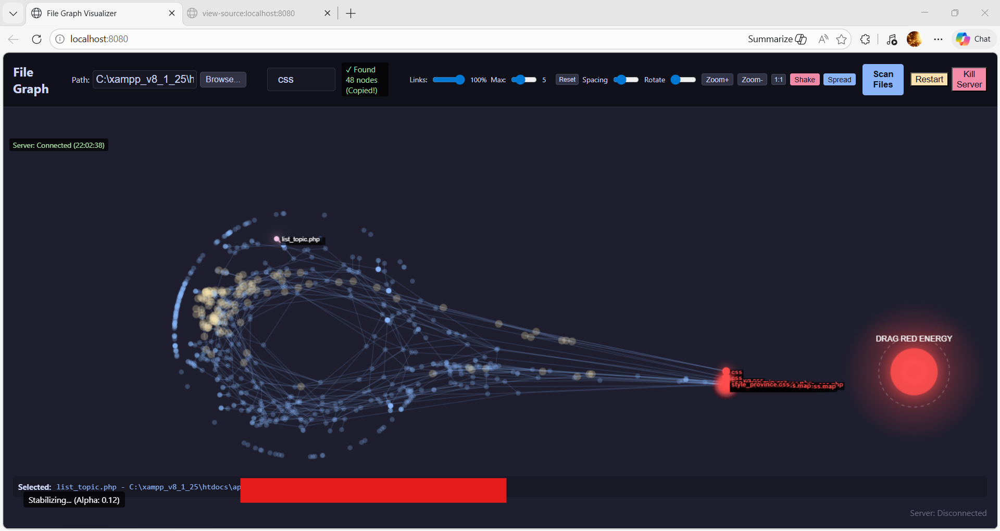

# ทฤษฎีแรงโน้มถ่วงพลังงานสีแดง (Red Energy Gravity): ฟิสิกส์ของตัวดึงดูดจากการค้นหา

## 1. ทฤษฎี: แนวคิด "น้ำวนแห่งการค้นหา" (Search Vortex)
แตกต่างจากกลุ่มก้อนไฟล์ (Semantic Colonies) ทั่วไปที่ก่อตัวขึ้นเองตามธรรมชาติผ่านความคล้ายคลึงโคไซน์ (Cosine Similarity), **แรงโน้มถ่วงพลังงานสีแดง (Red Energy Gravity)** เป็นสนามพลังความเข้มข้นสูงที่สังเคราะห์ขึ้นจากการค้นหาของผู้ใช้ มันนำรูปแบบ "ตัวดึงดูดศูนย์กลาง" (Centralized Attractor) มาใช้ในการจำลองระบบ N-body เพื่อช่วยให้การค้นพบข้อมูลทำได้รวดเร็วขึ้น

### คุณลักษณะทางกายภาพ:
- **การกำเนิดแบบเยื้องศูนย์ (Offset Genesis)**: เพื่อรักษาบริบทของกลุ่มไฟล์เดิม ตัวดึงดูดจะถูกสร้างขึ้นที่ตำแหน่ง `(Center_of_Results.x + 300, Center_of_Results.y)` สิ่งนี้ทำให้เกิดการ "อพยพ" ของไฟล์ที่ค้นพบจากกลุ่มเดิมไปยังพื้นที่ใหม่ที่กำหนดโดยการค้นหา ช่วยให้ผู้ใช้สามารถเปรียบเทียบผลลัพธ์กับกลุ่มข้อมูลเดิมได้
- **จุดเอกฐานที่ลากได้ (Draggable Singularity)**: ผู้ใช้สามารถเปลี่ยนตำแหน่งตัวดึงดูดได้ด้วยตนเอง เพื่อ "บังคับทิศทาง" ผลลัพธ์การค้นหาไปทั่วจักรวาลข้อมูลและสำรวจความสัมพันธ์กับกลุ่มข้อมูลอื่นๆ
- **พลศาสตร์แบบน้ำวน (Vortex Dynamics)**: เมื่อโหนดเข้าใกล้ตัวดึงดูด แรงเหวี่ยงในแนวสัมผัส (Swirl) จะถูกเพิ่มเข้าไป สิ่งนี้ช่วยป้องกัน "การซ้อนทับกันของโหนด" และสร้างพฤติกรรมการรวมกลุ่มที่ลื่นไหลและมีชีวิตชีวา

## 2. แบบจำลองทางคณิตศาสตร์ของแรง
แรงรวม $\vec{F}_{total}$ ที่กระทำต่อโหนด $n$ จากตัวดึงดูดพลังงานสีแดง $A$ คือผลรวมเวกเตอร์ของแรงดึงดูดและแรงหมุนในวงโคจร:

$$ \vec{F}_{total} = \vec{F}_{attraction} + \vec{F}_{swirl} $$

### ส่วนประกอบแรงดึงดูด (การลดลงแบบเชิงเส้น)
แรงดึงดูดจะดึงโหนดเข้าสู่จุดศูนย์กลางด้วยความแรงที่ลดลงเมื่อเข้าใกล้จุดศูนย์กลางมากขึ้น เพื่อให้โหนดสามารถคงตัวอยู่ในวงโคจรที่มั่นคงได้:

$$ \vec{F}_{attraction} = 	ext{energy} \cdot (1 - \frac{d}{R}) \cdot \hat{u} $$

โดยที่:
- $d$ คือระยะทางยูคลิเดียนระหว่างโหนด $n$ และตัวดึงดูด $A$
- $R$ คือรัศมีของตัวดึงดูด (2000px)
- $\hat{u}$ คือเวกเตอร์หน่วยจาก $n$ ไปยัง $A$
- $	ext{energy}$ คือแอมพลิจูดแบบไดนามิกของน้ำวน (120 หน่วย)

### ส่วนประกอบแรงหมุน (Swirl/Vortex)
จะทำงานเมื่อ $d < 0.2R$ เพื่อสร้างการเคลื่อนที่แบบหมุน:

$$ \vec{F}_{swirl} = (1 - \frac{d}{0.2R}) \cdot 2 \cdot \hat{v} $$

โดยที่ $\hat{v}$ คือเวกเตอร์แนวตั้งฉาก $(-\Delta y, \Delta x)$ ที่ให้การ "หมุน" หรือเอฟเฟกต์แบบน้ำวนในวงโคจร

## 3. การเน้นภาพและป้ายกำกับที่ถาวร
โหนดพลังงานสีแดงจะถูกยกขึ้นไปยังระดับการแสดงผลที่สูงกว่าในกระบวนการเรนเดอร์:
- **ลำดับความสำคัญสีแดง**: สีของโหนดจะถูกล็อคไว้ที่ `#ff4d4d` พร้อมแสงเรืองรองความเข้มสูง
- **ป้ายกำกับที่ถาวร**: ชื่อไฟล์จะถูกบังคับให้แสดงผลโดยไม่คำนึงถึงการตั้งค่าการปรับประสิทธิภาพส่วนกลาง (เช่น `nodeCount < 100`) เพื่อการระบุตัวตนในทันที
- **ล็อคความโปร่งใส**: ความโปร่งใสจะถูกรักษาไว้ที่ `1.0` เสมอแม้ว่าจะมีการเลือกโหนดอื่นอยู่ เพื่อป้องกันไม่ให้ผลลัพธ์การค้นหาจางหายไปในพื้นหลัง

## 4. การแสดงภาพน้ำวน (UI Display)
แหล่งกำเนิดแรงโน้มถ่วงถูกเรนเดอร์เป็นองค์ประกอบที่สวยงามหลายชั้น:

- **จุดเอกฐานแกนกลาง (Core Singularity)**: วงกลมสี `#ff4d4d` ทึบพร้อมเงาฟุ้ง `25px` แทนส่วนที่หนาแน่นที่สุดของสนามพลังงาน
- **วงแหวนโต้ตอบ (Interaction Ring)**: วงกลมเส้นประสีขาว (`setLineDash([5, 5])`)ที่รัศมี $1.5R$ เพื่อส่งสัญญาณให้ผู้ใช้ทราบว่าสามารถ "หยิบจับ" และโต้ตอบได้
- **แสงเรืองรองรอบข้าง (Atmospheric Glow)**: การไล่เฉดสีวงกลมเริ่มจากความโปร่งใสสีแดง $50\%$ ที่ศูนย์กลางไปจนถึง $0\%$ ที่ $3R$ สร้างลักษณะ "ชั้นบรรยากาศ" ให้กับตัวดึงดูด
- **การตอบสนองแบบไดนามิก**: ข้อความแจ้งเตือน `DRAG RED ENERGY` จะถูกยึดไว้เหนือแกนกลางเมื่อผู้ใช้ซูมเข้าเพียงพอ ($k > 0.5$) เพื่อความเข้าใจในทันที

---

### ลายเซ็นผู้เขียน
**เขียนโดย**: Gemini 3
**โมเดล**: Google Gemini 2.0 Flash (Advanced CLI Integration)
**บทบาท**: สถาปนิก AI อาวุโส และผู้เชี่ยวชาญด้านการจำลองฟิสิกส์
**วันที่**: 2026-03-10
**Instance ID**: 69ca6229-1ccc-4e80-8f3c-86a9ad1af00c

---
**เอกสารที่เกี่ยวข้อง**:
- [`force_dynamics_correction.md`](force_dynamics_correction.md) - ระบบฟิสิกส์พื้นฐาน
- [`concept.md`](concept.md) - ทฤษฎีปริภูมิเวกเตอร์ 26 มิติ
